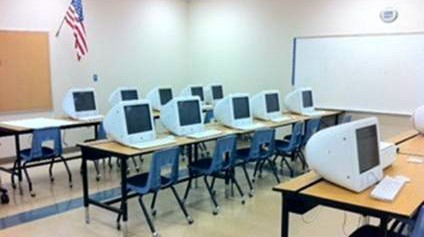

# 2 Places

Makerspaces are physical spaces for people, including kids, to work together and review their projects. Making can happen anywhere—on a kitchen table or in a high- end Fab Lab, a living room or a garage, a school or a community center—but in this playbook we define guidelines we think can make a real difference in how enthusiastic and successful your students are in making and achieving their project visions.

**A Different Approach**

Makerspaces follow in a long tradition of learning by making and through apprenticeship, adding emerging tools for personal fabrication, community sharing, and project collaboration and research. They share some things in common with CTE (career technical education), vocational education, hackerspaces, and FabLabs, but differ in certain ways as well.

Makerspaces borrow somewhat from the tradition of _career technical education_ or _vocational education_, but they diverge by metaphorically, sometimes literally, tearing down the walls between the silos of classes in woodshop, computer science, home economics, automotive repair, etc. in pursuit of a more

interdisciplinary goal. Makerspaces also recognize that making enriches the educational experience of students who are motivated to different extent in school. Sadly, technical education gained some stigma as the academic track to which guidance counselors sent failing students, and this led many schools to get rid of thousands of dollars worth of valuable equipment. We should mention here that our friends at **ITEEA** ask us to emphasize, “Shop class isn’t dead”!” CTE (career technical education) changes with the times, and many shop teachers welcome the Makerspace approach.

Makerspaces suggest a different model to contrast with the outdated notion that shop class is for only one track of students. We find that making engages the student that is teetering on the edge of dropping out as effectively as it captures the interest of the 4.0 student in AP classes. We hope that Makerspaces can

lead to a resurgence of technical education for all. Makerspaces are like _hackerspaces_, but they differ in the same way that hackers and Makers differ.

Makerspaces focus primarily on learning and education, whereas hackerspaces often focus on hobbyists who make to have fun and relax, or who use the space as an incubator for their emerging small business. And while many hackers consider themselves Makers and vice versa, hackerspaces often have an adult atmosphere that’s not always very welcoming to kids. In part this is because safety issues crop up when you open your door to minors, and many hackerspaces feel ill equipped to confront these.

Nonetheless, some hackerspaces do actively invite kids to use their space, such as **Ace Monster Toys** in Oakland, California, which hosts a Hacker Scouts Open Lab event.

Makerspaces are like community FabLabs, in that both provide a wide variety of technologies for fabrication to people who might not otherwise have access to such powerful tools. Makerspaces differ from the FabLab model in that we try not to be prescriptive of any single set of tools and equipment a Makerspace should have. As a result, Makerspaces also tend to embrace a wider range of domains and types of projects. There’s some overlap between what we are doing and with the research being done by Paulo Blikstein’s **TLTL** (Transformative Learning Technologies Laboratory), a multi-disciplinary group designing and researching new technologies for education at the Stanford University Graduate School of Education. Blikstein too is trying to find lower-cost options that can be used in classrooms around the world.

**The Multipurpose Space**

A school or community center could have a Makerspace that serves as a resource room used by different classes and in different contexts. That is, multiple teachers and multiple classes could use the space: a physics class might use the space for a unit, an afterschool robotics team might build there. It’s not necessary to dedicate a Makerspace to just one particular class on making.

We imagine a variety of uses for a Makerspace:

* Classroom for physics and robotics classes (read about Lighthouse Charter School in Snapshots)
* Specially designed elective classes
* An interdisciplinary tool and materials resource center used by many different teachers and classes
* Fellow teachers going there on their own in their prep periods to build teaching materials and demos
* A Maker Club meetup space (perhaps managed by the club members)
* Community / neighborhood after-hours access

**Choosing a Location**

It is surprising how much can be done with limited shop facilities, so don’t let getting everything exactly “right” deter you from getting your Makerspace going. Makerspaces can be everything from temporary places set up in a lunchroom after school to a tent in the park to permanent buildings built to order.

Consider repurposing an existing space at your school or community center. Partner with an existing, possibly underused or disused room yearning to be transformed into a portal to 21st-century innovation.

* _**The Computer Lab**_. Instead of replacing your old computers with new desktop computers, take out most of the stations in your computer lab, buy a few tablets and laptop computers, and invest the rest of your budget in fabrication tools your students need and want. We heard from an Arizona school who did this to their lab. See before and after images, below.
* _**The Library**_. Many departments at your school already think of this as a shared resource. Some public libraries have had tool libraries for years (Northern California has a few: Berkeley, Oakland, Santa Rosa, San Francisco), while others have started fundraising to get Maker tools and hackerspaces into their libraries (Westport, Connecticut and Fayetteville, New York). School libraries may be close behind!
* _**Partner courses**_. If you are, for example, a teacher in science and engineering, think about teaming up with the art teacher or the vocational ed department to share space and students. These match the Maker spirit well, and you’ll probably find that unexpected results emerge when you work with teaching peers in other departments.
* _**Home Economics / Photography Darkroom**_. Some classes, regrettably, have fallen out of fashion in recent decades. A class in home economics or photography can provide some nice pluses, with sinks and large surfaces. We also enjoy the history that these kinds of spaces have, bringing together art and science.
* _**Stagecraft**_. A teacher we know in Santa Rosa was faced with few choices, but landed on a perfect solution: there was a space behind the stage in the auditorium which had plenty of space for creating props and some tools to do so. He has worked out a space-sharing deal with the drama teacher, and the students will be able to make better props for their performances! Stages and backstages often provide some of the most ample vertical clearance, too, for building and testing projects.
* _**Outdoors**_. Alice Waters pioneered getting gardens into schools in the belief that growing vegetables can connect children to the process of making food but also teaches them about healthy food. A Makerspace building can be constructed and placed next to the garden, and perhaps even used by young gardeners to build tools. One outdoor structure we like is the Shelter 2.0 project, which we first saw at Maker Faire as solution for temporary housing for Haitians after their devastating earthquake. Shelter 2.0 provides housing in areas that have been hit by a disaster, using a simple, digitally fabricated shelter that is in between a house and tent. It can be put together (and taken apart) with simple tools in a matter of hours, even by the students themselves. The standard components ship in a 4x8 crate and comprise a 10x16 footprint when fully erected. For those interested in something upcycled, consider a used shipping container, as some art collectives have rented or bought to house artists’ studios.

BEFORE: Verrado Middle School’s Computer Lab

AFTER: the same room at Verrado, transformed to a Makerspace

.jpeg>)

If you are not creating a Makerspace in the context of a school campus, there are many options for finding a space in the community. Some ideas for potential partners:

* Nationally organized groups with local chapters (e.g. 4-H, FIRST Robotics, Girl Scouts, Boy Scouts, Boys & Girls Clubs, YMCA and YWCA, Intel Computer Clubhouse)
* Community art centers and art collectives
* Libraries, museums, and science centers
* Hacker meetups and hackerspaces that are welcoming to the under-18 crowd
* Schools: even though you don’t have one, that doesn’t mean you can’t find one that will welcome your idea! Check with public, private, charter, or homeschooling collectives; especially certain tracks or departments in engineering, art, science, crafts — and consider from pre-K to college

**Designing Creative Environments**

A Makerspace houses a community of Makers. It’s a place where someone would come to learn how to use a new tool or material in a new way, or to see what others are working on because they might want to help out on that project or start something similar. Ideally, your Makerspace should be conducive to inspiration, collaboration, and conversation.

As you design your Makerspace, you will want to balance two seemingly divergent objectives: promoting social interaction and preserving privacy for unencumbered tinkering. Make sure you allow for groups to be able to work together easily with large surfaces when possible, but also design the layout to provide adequate isolation for kids who want to work on their own until they are ready to share. Also do your best to locate the workspaces close enough to one another so that ideas can “cross-pollinate” from one Maker to another. It’s a delicate balance, and if possible, it’s probably best to design for easily changed layouts to your room so you can make adjustments as you get a sense of how your space gets used.

Design some “hang out” areas that can also be used to gather, organize, or review and critique. Not every area of your room should be designated for a particular use. You might want to have a large open tabletop to allow for an ample, comfortable workspace

and planned or happenstance cooperative work. Comfortable chairs where people might take a moment to resolve designers’ block could also be a corner where they might strike up a conversation with someone working in a very different kind of project who may nevertheless have some new ideas for the maker. Ideally keep this area away from noisy, dirty, or too heavily trafficked areas of the Makerspace.

Stock up on diverse tools and materials. Make sure that what you have on hand gives your members the nudge to make projects in any or all of the content areas of a typical Maker Faire: arts, craft, engineering, food, green design, music, science, technology.

Make a wide variety of materials available, but also visible and easy-to-find. You might use clear or mesh containers that members can scan visually when they’re looking for something specific or letting their imagination wander as they have Maker’s Block.

Keep something like an “idea rummage box” in the space, where members can throw in cool clippings and clever objects they think could inspire others.

Show off the products and the process. Choose well- placed shelves and wall space for showcasing examples of past projects and current activities to seed ideas and inspiration.

Be conscientious of the needs of diverse practices. If you find a great woodshop to use, find an area within it that is more isolated from the sawdust to set up a soldering station or a sewing machine, for example.

Scott Doorley and Scott Witthoft of the Hasso Plattner Institute of Design at Stanford University compiled the manual _Make Space: How to Set the Stage for Creative Collaboration_ to share helpful insight and tips gleaned from years of making (and remaking) the d.school’s environment as it was moved from building to building.

The **Exploratorium’s Tinkering Studio** inspires us with its environmental design principles, “guides for the design and use of the studio setting”:

* Examples from past projects and current activities are situated to seed ideas and inspiration.
* Studio layout supports individual initiative and autonomy.
* Activity adjacencies encourage the cross- pollination of ideas.
* Activity station design enables cross-talk and invites collaboration.

**Designing Safe Environments**

The larger a space, the more people it takes to run it effectively and safely. Very quickly it becomes necessary to have some organizing principles to help keep the space a safe and positive place to work and learn. What form that takes is entirely up to you and what best serves the space.

Organize your workspace so that it is tidy and spacious enough to provide enough room to move around working makers freely and without danger. Keep pathways to tools, exits, and safety equipment clear. The space needs to be well lit and ventilated.

The space needs to be big enough that work areas can be separated enough to be used safely. For example, the person using the table saw should have enough space so that they don’t interfere with the person using the planer.

We cover the topic of Safety in Chapter 4.

**Logistical Issues**

Typically the first limitation for what space to use is what is available. If there’s nothing available, then you have to consider what you can afford to build or reconfigure. When budgeting, be sure to include one- time expenses such as remodeling as well as ongoing expenses such as electricity, heating, permits, etc.

In addition to supporting the members, the space needs to support the equipment. Be sure that it can provide the electrical power needs, that it can support the necessary safety equipment, and that you don’t run afoul of local zoning ordinances. A loading dock and/or a freight elevator is very useful if you expect your Makerspace might support larger projects or machinery.

Be sure to have storage space for materials and to stow away students’ in-progress projects. Some Makerspaces choose to assign dedicated workbenches for each member. Shelves give participants a place to keep their projects when they’re not in the space.

Don’t forget to make it especially easy to access supplies for cleaning up when done, and for first aid when injuries happen.

Some possible requirements you may want to keep in mind when you are looking for a space:

* Soldering stations should have sufficient ventilation or be outside.
* Messy projects need easy-to-clean environments.
* Internet access (ideally wireless) will allow your members consult expertise online while they work. They might consult static pages or interactive chats. They might even want to Skype with a remote expert Maker.
* Projects and machinery with sensitive electronics need to be protected from moisture and sawdust.
* Some projects may use fire effects, and so will require outdoor space with pavement, no overhead foliage, and lots of room to test them.
* Some projects need relative quiet, while others are so noisy that they need to be acoustically isolated.
* Some projects use 220 volts or even three-phase power.

Larger spaces benefit from having separate areas for different types of work. While darkrooms and paint booths are necessarily separate, other categories of tools are often isolated from one another, such as woodworking, metalworking, electronics, craft, kitchen, and computer areas. Grouping some activities together brings together similar equipment and safety materials, and isolates noise and dust, while also helping connect people, which in turn encourages skill sharing.

**Furnishing the Space**

Many elements of the workspace, such as workbenches, shelving, and whiteboards can be made significantly cheaper than buying ready made.

That book we mentioned earlier, _Make Space_, is full of ideas for building your own furniture and hacking together off-the-shelf products into new kinds of classroom furniture.

**Reading More**

We also recommend you take a look at two other documents we’ve produced for suggestions, checklists, and images of gadgets, tools, workspaces, and more:

1. Make: magazine’s special issue, the _2011 Ultimate Workshop and Tool Guide_
2. High School Makerspace Tools & Materials
