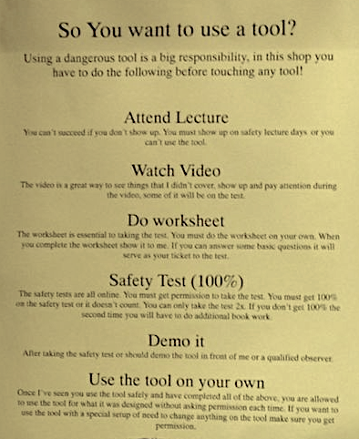
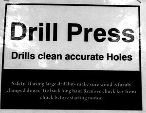
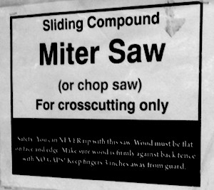

# 4 Safety

No matter how you equip your shop, it’s likely that if you are doing anything interesting with your members there are some risks involved. Be sure to emphasize safety to the members of your Makerspace. Learning how to use a tool isn’t all that helpful unless you also learn all the risks and precautions you have to take in order to come out of your project build with all your eyes, ears, fingers, and limbs intact.

It’s a fine line, though, between informing kids about the potential dangers and scaring them from ever using any interesting tools! While accidents happen when the proper steps aren’t taken, many millions, perhaps billions, of people make with dangerous equipment every day without incident. Our goal is to make safety second nature for kids, so that they feel at ease when they use the tools because they know they have protected themselves and prepared as much as they could before lifting the tool or clicking its power switch.

It doesn’t take much to cause permanent disability. The more powerful and more complex the tool, the more damage it can cause, and the faster it can cause it. While we all hope the worst doesn’t happen, you and your students must be aware of the danger and prepare.

Consider creating a “Maker mantra” that covers potential risks in your shop, that your Makerspace can chant as you get started with each build session.

Perhaps something like:

_Protect. Double-check. Aim away._&#x20;

_Clamp it. Focus. Never play._

**Planning for Safety**

Stimulating a culture of safety can dramatically cut down on shop mishaps as members are encouraged members to watch out for the safety of each other and respect the equipment. You can accomplish this by modeling safe behavior in your own actions and in how

you set up the space, setting up a strict training regimen, and posting signs and checklists.

Makerspace users of all ages need to be trained in safely operating tools before using them. And they also need reminders. In Hillel Posner’s woodshop in Pittsburg, California, he has a multi-step process for being certified on a machine before the student is able to use it independently. Then he also posts a sign on each machine to explain its ideal application and some key safety guidelines.

.jpeg>).jpeg>).jpeg>).jpeg>).jpeg>)

Cleaning up is not just a measure of respect for the workspace, it also removes hazards. Plan to easily and regularly remove trash and debris. Enforce a strict cleanup policy throughout the workspace. Keep work areas tidy as well by minimizing the number of wires running around. Extension cords quickly become tripping hazards, and power strips also cause trouble on the ground or as they tumble erratically on a desktop. We suggest you provide access to grounded outlets all along the perimeter of the room and/or dropped from the ceiling for each workbench.

Tools need to have enough space to be operated safely and not endanger the operator or other people in the space. People need to concentrate when trying new tools, especially ones that can injure. Make sure there is enough real estate to use a tool safely. Work areas need to be well lit and clean. Ventilation and/or air filtering is required for many tools.

The equipment itself needs to be as safe as possible. Tools should be well maintained and not have safety features removed or defeated. This is especially important when using second-hand tools that might not have a perfectly safe heritage. When acquiring new tools consider spending the extra money on models with advanced safety features, such as a SawStop table saw.

Make well-stocked first-aid kits visible and easily accessible throughout your space. Post clear and visible warning signs on all equipment and where necessary.

Provide personal safety equipment such as goggles, earplugs, gloves, etc. to those who don’t have their own.

Accidents may happen. They probably will, and let’s hope they are all minor. Nonetheless, do make sure that there is a legal entity that owns the space so that the effects of a serious injury don’t extend the horror with legal ramifications. If you house the Makerspace at a school, the district’s coverage would likely suffice. If there’s no legal entity, we suggest you form an LLC or a corporation to shield individual members from any liability.

**Common Rules**

It seems like every teacher writes their own rules, often adapting someone else’s rules to the idiosyncrasies of his or her own space, and adding more as they go along (and students reveal new rules that need to be written!) Rules work best when they are in your own voice, as you’ll be repeating them often.

.jpeg>)

William Gurstelle wrote a piece called “The Safe Workshop: Rules to make by” for our 2011 Ultimate Workshop and Tool Guide, and we’ve included the text in Chapter 12, Resources.

Common safety rules we’ve seen posted in shops and other making classrooms are listed on the next page.

**Common Makerspace / Workshop Rules**

**The emergency phone number is**

**9-1-1**

_(or describe your emergency procedure here.)_

**Report all injuries.**

* Do not attempt to remove foreign objects from the eye or body.
* If chemicals get in the eye(s), wash eye(s) for 15 minutes in an open flow of water before proceeding for medical treatment.

**Use protective gear. Dress right.**

* Wear eye protection: safety glasses with side shields, goggles, or face shields at all times, whether working or not!!
* Do not wear loose-fitting clothing around moving or rotating machinery.
* Remove ties, jewelry, gloves, etc. especially around moving or rotating machinery.
* Tie back or cover long hair to keep it away from moving machinery.
* Wear only shoes that cover the entire foot, no open-toe shoes or sandals.
* Wear suitable gloves when handling hot objects, glass, or sharp-edged items.
* Wear appropriate clothing for the job (i.e., do not wear short sleeve shirts or short pants when welding).

**Prepare.**

* Safety is your top priority when using the shop. If you are not sure what you are doing, ask.
* Know all the locations of all first aid, fire, and safety equipment.
* Never use a tool unless you’ve been trained to use it safely.
* Never work alone when using power tools. Two persons must be present and be able to see one another.
* Sign in before using any equipment.
* Do not work in the shop if tired, or in a hurry.
* Do not fool around, startle, or distract anyone (not even with a conversation) while either one of you is using a tool.
* Think through the entire job before starting. Prepare prints or drawings with all dimensions and specifications prior to using machines.

**Use tools right.**

* Use tools only as they were designed to be used. (A wrench is not a hammer.)
* Never use a broken tool.
* Report any broken tools or machines immediately.
* Do not remove tools from the room.
* Never walk away from a tool that is still on.
* A hard hammer should not be used to strike a hardened tool or any machine part. Use a soft- faced hammer.
* Operate machines only with all required guards and shields in place.

**Clean up.**

* Clean up every time whenever you leave an area, including sweeping the floor.
* Clean and return all tools to where you got them.
* Use compressed air sparingly; never aim it at another person or use it to clean hair or clothes.
* Shut off and unplug machines when cleaning, repairing, or oiling.
* Never use a rag near moving machinery.
* Use a brush, hook, or a special tool to remove chips, shavings, etc. from the work area. Never use the hands.
* Keep fingers clear of the point of operation of machines by using special tools or devices, such as, push sticks, hooks, pliers, etc.
* Keep the floor around machines clean, dry, and free from trip hazards. Do not allow chips to accumulate.
* Mop up spills immediately and put a chair or cone over them if they are wet enough to cause someone to slip.

**Specific Safety Guidelines**

Tools are safe when used responsibly. But even simple hand tools can cause accidental scrapes, cuts, and pinches. Hammers can crush or produce flying debris. Here are some other more specific safety guidelines often connected to certain kinds of tools.

* **Flying objects.** Safety glasses should be worn at all times in the shop, especially while working near hammers and power tools to protect eyes from flying debris. Enforce eye protection while members solder.
* **Invisible dangers.** Safety doesn’t only mean avoiding gushing blood. Foster good habits of consumerism by encouraging your students to choose materials with full knowledge of the potential long-term effects of their use. For example, never use a laser cutter to cut PVC or other chlorinated plastics. Lexan and PC board are also strongly discouraged. PVC gives off chlorine gas, which is dangerous for any nearby people and also highly corrosive to the machine. Many shipments are accompanied by a material safety data sheet (MSDS), and if they aren’t, then these are usually accessible online.
* **The air you breathe.** Respirators (masks) should also be worn when sanding with either a power sander or by hand. Any kind of soldering generates fumes from the rosin core of the solder so the area should be ventilated. Under normal soldering conditions, solder containing lead poses no health risk, though makers should be encouraged to wash their hands after a long period of handling leaded solder. Lead-free solder is available but less recommended because the rosin gives off much more toxic fumes when soldering, is more corrosive to soldering tips, requires higher temperatures to solder with, and is generally harder to work with.
* **Note the name: “power” tools.** They are powerful. Some power tools are heavy and should be not be used by makers who don’t have the strength to control the tool well. Power tools can grab anything that dangles near them. When using any power tool long hair should be tied up, and loose clothes and jewelry should be secured.
* **Multiple risks.** Electric saws have high-power moving blades that can quickly cause traumatic injuries. However the chance of injury is small when properly maintained and used with care and attention. In addition to safety glasses, respirators (masks) and earplugs should be worn during use of electric saws.
* **Fire**. Heat guns and handheld torches can generate fires if used without proper attention to the work and surrounding areas.
* **Burns**. Make sure there’s cool running water nearby for burns. Use the lower-heat glue guns when possible. The tip of a soldering iron heats to about 400°F, hot enough to cause burns. It should be handled attentively. Steam irons (used in sewing) do get hot enough to cause burns.
* **Sewing** can cause a small prick from a needle, but sewing machines and sergers both have enough power to put a needle through a finger when used carelessly. Sergers also have blades that can cut a careless finger.
* **Metalwork** areas need welding screens or curtains to prevent eye damage in passersby. Visors should be worn while welding.

**Safety Plans**

Makers who display, operate, or use any items that pose a danger to others — such as fire (including all heat-producing or open-flame devices, candles, lamps, etc.), explosions, internal combustion, flammable liquids, compressed gases, hazardous chemicals, launches, sharp or otherwise dangerous materials or tools — will have to explain what they’ll do to keep others safe when they exhibit their project to others. Whether or not your showcase event will require a written Safety Plan, creating one is a wise habit to establish among your students. We’ve included a template for a Safety Plan in the Resources chapter.

Safety plans make you and your students more confident that you are all aware of the foreseeable risks, considered possible consequences, and have taken all the precautions you could to ensure everyone’s safety.

Maker Faire requires safety plans for any projects that would display, operate, or use any of these:

* Lamps and other heat-producing devices including hot glue guns
* Open flames, burners, candles, etc.
* Internal-combustion engines
* Flammable liquids, compressed gases, or dangerous chemicals including propane and helium
* Any potentially hazardous electrical / mechanical device or chemical / biological substance

Safety plans typically include a description of the exhibit or demonstration, the names, qualifications and previous experience of people working the exhibit, a description of general safety precautions, and the emergency plan. If the project includes fire, the safety plan should also describe the fuel source, how much is onsite, where and how it is stored, how much is burning and in what amount of time it burns, and if the valve has an electronic propane sniffer.

By the way, there’s usually a different process for people who plan to serve food to people they don’t know (the public), which involves getting a city permit.
