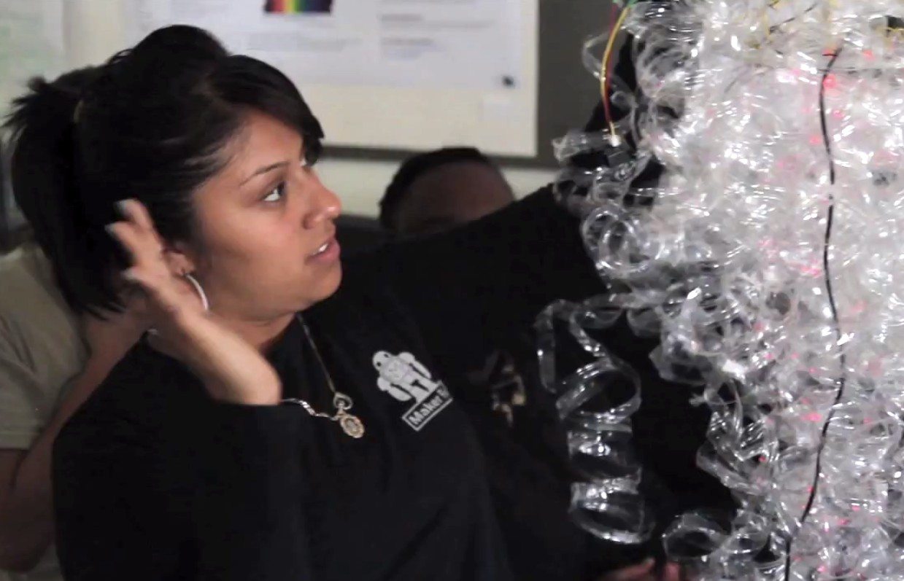

# 7 A Year of Making

_**Editor’s note:** This helpful chapter comes from Aaron Vanderwerff of Lighthouse Community Charter School._

In describing a year in a making classroom, we envision projects on a spectrum from teacher-led to independent. Students all make the same object, with slight variations, in teacher-led projects. Independent projects are student-led from the concept to the product. Most projects fall somewhere between the two extremes.

For example, some student projects are entirely the students’ own vision, some are hybrids of projects they have seen in Make magazine and on the Internet, and some projects are pulled from a website, following the instructions they read online. Students learn different concepts from different types of projects.

_**Teacher-led projects** teach students..._

* _to be creators, not only consumers._
* _new skills (hands-on, design, collaborative.)_
* _to have pride in their work._

More independent, student-visioned projects allow students to see their own idea come to fruition. For many students, this is the first time they have participated in a long-term, open-ended project. This experience mirrors the post-high school world much more closely than a majority of schoolwork. The very process of thinking up an idea and creating it is the major learning goal for independent student projects. This process is not self-evident, and is best learned by going through it multiple times. Each time students complete the design and build process, they gain confidence to complete future projects.

_**Independent projects** teach students..._

* _to take a concept and turn it into a real prototype, allowing students to experience the full journey of creation (including bumps and difficulties.)_
* _to use resources (mentors, teacher, internet, magazine, etc.) to create a project._
* _to grow creation skills (sewing, woodworking, programming, circuitry, soldering, etc.)_
* _to explain their project and their creation process to an audience._

**Year-Long Timeline**

* _**August – November**_: Students build their skills. They learn C programming using robots and develop basic skills in woodworking, crafting, soldering, and use of Arduino for making. Through this period, they work for two weeks on robotics followed by one week of making skill building.
* _**December – March**_: Students develop their own vision for a Maker Faire project and create a first draft of the project to show at a local LCCS Maker Faire (school organized); they continue working on robots. Through this period, students work one day in class each week on making their independent project. The remainder of the time required happens outside of class.
* _**March – May**_: Students refine their Maker Faire project for exhibition in San Mateo; they also compete in a robotics competition. Through this period, students continue making in class once a week until mid-April, when they are able to use all class time to finish their project and prepare for exhibiting at the Maker Faire.

**The Class Context**

The students participating in making are enrolled in Robotics class, which is in its fourth year at Lighthouse. During that time, students have participated in the regional Botball competition each year. Two years ago, by participating in Young Makers, we added an independent project to the curriculum, which students showcase at the Maker Faire in San Mateo each spring. From August through November, the robotics curriculum supports basic skill development in collaboration, programming, mechanical design, and creation skills (woodworking, soldering, sewing, etc.). The remainder of the year is spent preparing for the Botball competition by running mock competitions using last year’s rules and preparing for Maker Faire by working with mentors to hone each small groups’ project vision and bring it to fruition. In the spring, all students participate in a robotics competition and take a project to the Maker Faire.

Students in the Robotics class are 11th and

12th graders, low-income, and are usually the first in their families to attend college. The class generally has about 24 students enrolled and runs for 70 minutes four times each week. In the past, most students in the class did not choose to take Robotics and were intimidated by the class at the beginning of the year; this year, however, students have some choice of which science classes they take, but they are ultimately assigned to the class.

The classroom space we use for making is a science lab. We do most ‘clean’ activities such as soldering, programming, and assembly inside the lab. Outside the lab are picnic tables that we use for ‘dirty’ activities like woodworking.

The primary purpose of the Robotics class is to give students multiple opportunities to work on long-term, collaborative projects which more closely reflect what students will encounter in college and the work world. The class is designed to expose students to a variety of technical careers and prepare those who are interested in studying technical areas for their post- secondary studies. Making provides an additional component, allowing students to conceive of an idea, try it out, and make it happen. Along the way they fail, change their plan, try it again, fail again, learn from others and try something different. They learn that making a vision reality is not easy, but that it is within their reach.

**PHASE 1 BUILDING SKILLS**

_(1 to 2 weeks per skill, Mid August - End October)_

After having worked with students on independent projects our first year, I decided that I would use fun, interesting, skill-building projects in the beginning of the year to get students more comfortable with the idea of making. Projects were designed to develop skills many student groups needed in order to complete their independent projects. I wanted to expose all students to different types of projects so they would not be intimidated by a specific project because it involved a saw or a sewing machine. These skill-building projects were done between two week robotics projects to maintain student interest. I had students work in same-gender pairs to discourage gender stereotyping of who should be using specific tools. In the end, all students developed some proficiency in all areas.

Our areas of focus were:

* Soldering
* Woodworking
* Crafting
* Using an Arduino and Shield

**Soldering**

Working in same-gender teams of two, students assembled **Elenco Soldering Kits**. (Two pairs of students shared a soldering iron, so I needed one soldering iron per 4 students.) The kits have soldering practice areas for students to try before they are assembling electronics they might burn up. They come with step-by-step instructions and a description of the different electronic components. After showing students the basics of soldering, pairs showed me their first few soldering joints, and I was able to give them individual feedback. Throughout the week, I circulated through the class, providing feedback to students and ensuring that all students were participating in soldering. At the end of the week students passed the projects if their kit worked.

Pairs whose projects didn’t work had to check for incomplete solders or soldering joints that were bridged. Students struggled to desolder incorrect joints and often delaminated the pad because they would heat it too much. Students whose projects didn’t work the first time were given a second kit if the first was beyond repair and had to solder it on their own time.

**Woodworking**

Working in same gender teams of two, students built chairs based on the ‘stud chair’ (_Make_ magazine, volume 27, page 122). To complete the project, students learned to use a small circular saw, a hand saw, and a drill. This year, I plan to either use a different plan or use lumber that is already the correct dimension (2”x2”s and 1”x4”s), so that we do not have to use a table saw.

Students started by cutting the 8’ - 2”x4” into the proper lengths. Another teacher brought a table saw in to make the rip cuts. He made the cuts during class, showing students how to safely use the tool. Students then assembled the chair, squaring corners, pre- drilling holes, and gluing joints before they screwed the boards together. Keeping all corners square proved to be one of the major difficulties for students, but the end products made it clear why taking time to work carefully made a difference; the more precise the cuts and the more square the chair, the sturdier the chair was.

During this project, I gave each student an extremely short lesson on the tool they were using and assessed their knowledge before they were approved to use that tool. This tool lesson was meant to increase competence and decrease fear. For example, when using the cordless circular saw I asked students to show me how they would hold the saw – reminding them that both hands must be on the two parts of the handles (it’s hard to cut your hand if it is holding a handle).

Next I asked them to turn it on and turn it off right after so they knew what it felt like when it was on. I followed by showing them how to line the saw up with their mark and back it off the wood before they started the saw. Finally, I allowed them to cut. I also provided small group instruction on using the square and the drill. Students showed me their clamped together parts before they pre-drilled the holes so I could measure how square it was.

The class shares a circular saw and a few hand saws. Having multiple goggles, drills, squares, clamps, and bottles of wood-glue (one set of each per four students) allows this project to flow more smoothly. These materials can be borrowed for the week if your school doesn’t have them.

**Crafting**

Staying with their partner from the woodworking project, students decorated their chairs and made a cushion for the seat. Students started by painting and decoupaging their chairs. Students embroidered a design onto a piece of fabric that would be the front of their cushion. They were required to include one button in their design. They traced their designs from something they drew or printed by placing fabric (recycled sheets) over the design on a window.

Each partner took turns hand embroidering the design. Students learned to use the sewing machine to sew the back and front of the pillow together. They stuffed the pillows and sewed the final edge together by hand.

A part-time teacher assisted in the instruction of students in sewing. After initial instructions on each of the areas of crafting, we both circulated to help students when they were not sure how to proceed. After students completed the embroidery of their pillow, both of us worked with students to safely use the sewing machines.

This year, I plan to have students start the week developing a cohesive vision for the design of all parts of their chair, and I’ll add a simple electronic component to their pillow so they can start to see the intersection of crafting and technology using soft- circuits.

This project requires a sewing machine for the class and an embroidery hoop and needle for each pair. Students also need paint, brushes, decoupage glue, thread, and fabric.

**Using an Arduino and Shield**

Working with a partner, students put their soldering skills to the test again. Students were provided with an Arduino shield kit (**LoL Shield** and **WaveShield**) which they assembled. I chose these shields because of the inherent appeal of making an iPod-like device and a message/screen device. The LoL shield took the entire week to assemble because there were so many LEDs to solder. LoL shield users were able to assemble and run a couple quick programs from the library.

Generally they were able to change the message on the shield, but didn’t get too much further than that in programming the Arduino. WaveShield users were able to finish soldering earlier, which was good because music must be reformatted to be compatible with the shield. On a Mac this is relatively easy, whereas on a PC it took some time to find and install the correct programs. Students were able to get their shield up and running and show me it worked by playing a song of their choice. They also played a bit more with programs in the library than the LoL shield group was able to do. Initially there were also small issues in installing the libraries. I ended up installing them on all the computers because of the Admin password issues (putting files into the Program Files folder).

This year, we are planning to completely change this project. We have two ideas currently and plan on choosing one based on the group of students in class and their preferences.

* **Option 1: Using the Examples** – Students will use the examples already built into the Arduino program. By doing this they will learn to use example code and relate it to the C programming they already did in the robotics portion of the class. In addition, they will learn to interpret the circuit descriptions in these example files. Students will work through a series of these examples chosen to highlight specific electronic components and programming skills. They will be asked to modify the programs to make a visible change (e.g. make the light turn off twice as long as it was on while it blinks) and to combine multiple programs (e.g. make the light blink when the button is pushed).
* **Option 2: Semi-Independent Project** – Students will be provided with a menu of options for a semi- independent project. Since the next thing students will work on is a vision for their Maker Faire project, this would give us a chance to help them think through some of what they will encounter in working on their own projects. These projects will be designed to take seven days in class and will use an Arduino and basic electronics/sensors. Students will provided with instructions for the project of their choice. The directions will be pulled from the Arduino cookbook or online.

**PHASE 2**

**INDEPENDENT MAKER FAIRE PROJECTS**

Starting an independent project can be a daunting task, especially if your students have never been asked to take something like this on before. For my students it is especially intimidating because of the six-month timeframe of the project, the fact that they will be required to learn new skills that will be different from their peers, and also because they are being asked to innovate in some way.

During the first two weeks of November (at the same time as the Arduino project), students were given the assignment to look through Make magazine and find projects that interested them. Each week they were given the opportunity to see more projects and share interesting projects in a class discussion. At the end of the second week, students were asked to form groups of one to three based on common interests and compatible schedules (because they need to work outside of class on projects). The week before Thanksgiving break, they were given the task of coming up with a project concept for something they were interested in pursuing. The major requirement was that they thought it would be something that would hold their interest. Over Thanksgiving break, they started their initial project plan. The Monday after Thanksgiving, students met mentors for the first time. I split students into three groups and mentors circulated, giving feedback and ideas to each project group. This gave students a chance to get feedback and hear how feedback is given to other groups. After the class, mentors gave preferences for groups they thought they could best support. Students were given

their mentor assignments later that week and shared their initial project plans with mentors.

The process we have developed at Lighthouse is intended to help our students make their way through creating an initial project vision. We’ve defined five stages of getting started on an independent project:

* Explore (2 months)
* Share ideas (2 weeks)
* Individual ideas (1 week)
* Project proposal (1 week)
* Project presentations and refinement (continual through project deadline)

We describe each of these stages in greater detail below.

**EXPLORE** _(2 months)_

_**Goal**: Students exposed to new ideas learn new skills._

Students are given multiple opportunities to explore because they generally have had little exposure to DIY style projects (from any genre). The first exposure to new types of projects comes as we work on our skill builders, where students are exposed to woodworking, design, embroidery, soft-circuits, soldering, and using the Arduino. As we started to work on the basics of Arduino, and during the following three-week period, students were shown videos of different projects at the beginning of class that could inspire them to think about different ideas for their own projects. In the second and third week of our Arduino unit students have the opportunity to carry out a project that is similar in process to their individual projects, except that they will be assisted with the steps by a teacher throughout; this provides students with a glimpse at how a more complicated project could come together. As students are exploring and sharing ideas, they are recording the ideas they find the most interesting in their journals.

**SHARE IDEAS** _(2 weeks)_

_**Goal**: Students use print and Internet sources to find ideas for projects._

At the same time as they work on their Arduino projects, students checked out Make magazines and were encouraged to explore **Instructables**. After looking over these materials, students shared a project they found interesting and explained why they found it interesting. It is important to remind students that at this stage they are not choosing a project, they are only sharing something they found in order to better inform themselves and their peers. This process can be repeated multiple times and can be used to start discussions with the group about what students and teachers are looking for in a project.

**INDIVIDUAL IDEAS** _(1 week)_

_**Goal**: Students express their own ideas, hear other students’ ideas, and start to get excited about them._

Our students then write up individual ideas for projects. Although we eventually want students to work in teams of one to three, we ask them to complete this step individually to push them to have agency in the project they eventually choose. Listening to each other’s ideas encourages them to choose who they work with based on project interest more than peer-relationships. We find this important because students in groups bound together by a project have historically shared the work more evenly as long as they could find time to work together; whereas groups of friends often don’t share the work equally because they don’t have equal levels of interest in the project.

Students were provided with the following prompt and will present their idea to the group during class.

_Be sure the project you describe is something you think you will be interested in over the 6 months you will be working on it. Remember, it does not need to be a robot or electronic - it can be mechanical, sewing, crafting, an interactive experience, programming, electronic, robotic, etc. Finally, you must work on this proposal on your own and be open to working with people whose ideas you like, but who you don’t know as well._

1. _Describe a project have thought about that you would like to make. You may base your project on those we have seen over the past couple of months._
2. _What does it do and how does it work?_
3. _Why is it interesting or exciting to you?_
4. _If this project is based on another project, how will you make it your own? How will you improve or change it?_

During the class discussion, all students share their ideas. As each student shares, their peers are encouraged to ask clarifying questions. It is helpful to remind students that this is not their final project; they are just putting an idea out to the group to add to the diversity of ideas. In addition, students take notes on at least three project ideas they thought were the most interesting. The teacher, meanwhile, is taking notes and pairing up project ideas in order to offer suggestions at the end of the presentations. Once everyone is done presenting, the teacher asks students to identify their top two projects. Each student is then asked to go discuss these projects with the project’s originators. This was the first year we tried this step in the process and it did mix the groups more than has happened in the past. Since we have some tight knit groups of friends in the class, we asked students to talk to others they don’t know as well.

Through these discussions students are asked to decide who they want to work with based on common interest and availability (outside of school schedules). They give their group lists to the teacher before leaving for the day.

**One Project Team’s Story**

When everyone else had a team and a vision, these three girls found themselves left without either. In fact, they hadn’t really wanted to be in the class in the first place. So they decided to be a team. They toyed around with many ideas. They saw articles in _Make_ about a magic mirror that got them thinking about how to create a project that would interact with people, and they saw others made from recycled materials that inspired them to think about creative reuse as well. Still, they had trouble putting it together into a concrete idea.

Their first idea was to create a picture frame out of recycled materials, integrate a webcam into the frame, and have the picture in the frame be the person looking at it. They wanted it triggered somehow, maybe even changed in a playful way, but they couldn’t figure out how. They discussed this idea with each other for weeks, researched online, talked with their mentor, but they couldn’t get past the idea stage.

At some point, I am not sure why, they decided to scrap their first idea and start over. But the recycling theme stuck and they discovered that if you cut a plastic water bottle in a spiral it makes a pretty cool looking curl. This was the a-ha moment. A spiral of clear plastic became the centerpiece from which they built. They had to figure out how to make it work, and the process took many iterations, but when they were done, they had created their own recycled LED chandelier. At Maker Faire that spring, many people stopped to look at it, intrigued by the same curls that had finally inspired the team.

**PROJECT PROPOSAL** _(1 week)_

_**Goal**: Students express the object or experience they would like to create._

Groups of students work together prepare a project proposal in order to get ready for a final pre-project presentation to their future mentors. In our class, this work is done as homework, but it could easily be done in class with teacher guidance. Each group is given the following format for their proposal:

_If you are having trouble coming up with an idea - or aren’t satisfied with your current idea, there are a bunch of websites with ideas at the_ **Young Makers site**_, my_ **blog site** _which I will keep updating, or even go look at what some_ **suppliers** _have to offer. In addition, you can come up with hybrid ideas (meaning two ideas that already exist combined into something new) by cutting out pictures from magazines or printing some out from the web and arranging them in pairs until you find something interesting!_

* _Name of Project:_
* _Participants (who is your time manager?):_
* _Primary Mentor (To be determined):_
* _Mentor Contact Information:_
* _Project Description (1 paragraph):_
* _Divide your project into smaller projects – in other words what are the different types of tasks you will need to accomplish in order to complete this project? (e.g. electronics to control lights and motors/ mechanical systems to be able to grasp an object)_
* _What is your plan for splitting these sub projects among your group members?_

_Your homework will be to spend a minimum of two hours per week per person working on your project. You will keep track of this work in your project journal (online) and it will be assessed each month. Part of your homework will be to communicate with your mentor, update your plan, and attend Young Maker events (dates to be announced)._

* _How do you and your team plan to decide what homework you are giving yourselves – and how will you split it up?_

**PROJECT PRESENTATIONS AND REFINEMENT**

_(continual through project deadline)_

_**Goal**: Students receive feedback from a knowledge- able source and to break the project into smaller pieces that can be worked on concurrently._

Students presented their project ideas to a group of their peers and a mentor. After each presentation, students were given feedback, mostly by mentors.

Mentors generally need guidance from the teacher about what type of feedback you want students to receive so it is helpful, yet not overwhelming. Our mentors were asked to help students split their project into sub-projects because students often struggle with this key step, but it helps projects move forward efficiently.

After receiving this feedback from mentors, students start to work out the sub-projects they will need to plan for. Students use the organizing table below to start planning the sub-projects:

_Sub-projects: Write a description of each sub-project below. Then fill in the table._

_Confidence: Rate how well you understand this step from 1 (I have done it before) to 5 (I really don’t have a clue how to do this and will need to do research / talk to mentor and teachers to accomplish it)_

| **Sub-project** | **Skills Needed & Confidence** | **Materials Needed** | **Time Needed** | **Who is in charge?** | **Time with modifier** |
| --------------- | ------------------------------ | -------------------- | --------------- | --------------------- | ---------------------- |
| 1               |                                |                      |                 |                       |                        |
| 2               |                                |                      |                 |                       |                        |
| 3               |                                |                      |                 |                       |                        |
| 4               |                                |                      |                 |                       |                        |

**Bringing an idea to life**

Every year it is a pleasure to watch students move towards creating a project vision. Getting a group of students to their own idea of a creation is often not at all linear and you generally end up asking yourself how they came up with the idea they present. After completing the process earlier this year, one of my students told the group that it is “exciting to think that right now we have a bunch of creative ideas, and in six months these ideas will have come to life.” Each year we go through this process it seems to get easier for students to find a vision. I wonder if that is due to our teaching practice improving, or if it is because students have seen those in earlier classes come up with ideas which has shown them what is possible.
